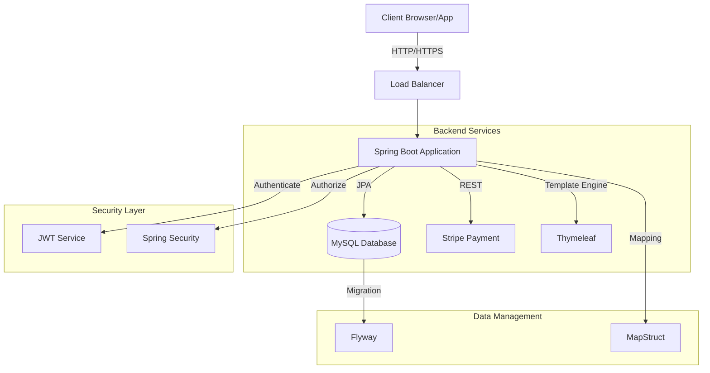

# E-Commerce Store Application

A modern e-commerce application built with Spring Boot 3 and Java 23, providing a robust platform for online retail operations with secure user authentication and payment processing capabilities.

## Features

- 🔐 Secure authentication and authorization using Spring Security and JWT
- 💳 Payment processing integration with Stripe
- 🛍️ Product management and inventory control
- 👤 User role-based access control (Admin/Customer)
- 📝 Database migrations with Flyway
- 📚 API documentation with SpringDoc OpenAPI
- 🎨 Server-side rendering with Thymeleaf
- ✅ Input validation and data integrity checks
- 🗃️ MySQL database with JPA/Hibernate

## Security

This application implements a robust security model using:
- JWT-based authentication
- Role-based access control
- Spring Security configuration
- Secure password handling

## Architecture

## Technologies

- **Java 23**
- **Spring Boot 3.4.1**
- **Spring Security**
- **Spring Data JPA**
- **MySQL**
- **Flyway Migration**
- **JWT (JSON Web Tokens)**
- **Thymeleaf**
- **MapStruct**
- **Lombok**
- **Stripe API**
- **SpringDoc OpenAPI**
- **Maven**

## Prerequisites

Before running this application, make sure you have:

- Java 17 or higher installed
- Maven build tool
- MySQL Server
- IDE (recommended: IntelliJ IDEA, Eclipse, or VS Code)

## Getting Started

1. Clone the repository
2. Configure the environment variables:
  - Copy `.env.example` to `.env`
  - Update the variables with your configurations

3. Configure the database:
  - Create a MySQL database
    - suggested url: `jdbc:mysql://localhost:3306/store?createDatabaseIfNotExist=true`
  - Update `application.properties` or environment variables with your database credentials
  - local development:
    - make sure to update `flyway.config` to be able to run migrations using maven goals (e.g. `mvn flyway:migrate`)

4. Run the database migrations
5. Build and run the application

## Project Structure

src/ \
├── main/ │ \
├── java/ │ \
│ └── com/alopez/store/ \
│ │ ├── admin/ # Admin-specific components \
│ │ ├── auth/ # Authentication and security \
│ │ └── [other-packages] \
│ └── resources/ \
│ ├── db/migration/ # Flyway migrations \
│ ├── templates/ # Thymeleaf templates \
│ └── application.properties \

## API Documentation

Once the application is running, you can access the API documentation at:
- Swagger UI: `http://localhost:8080/swagger-ui.html`
- OpenAPI spec: `http://localhost:8080/v3/api-docs`
